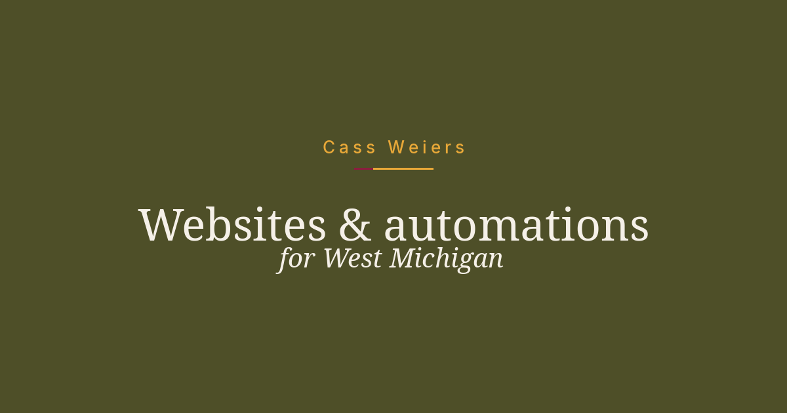

# Cass Weiers

Websites & automations for West Michigan

[](https://astro.build)

**[Live site](https://cassweiers.dev/)** · [Email](mailto:Cass@Cassweiers.dev) · [LinkedIn](https://www.linkedin.com/in/cass-weiers/)



## About

I'm Cass Weiers, a web developer in Comstock Park, just outside Grand Rapids. This repo is the source for [cassweiers.dev](https://cassweiers.dev/), the public site for my local LLC.

I build fixed-price websites and small automations for shops, studios, and nonprofits nearby. The work is practical: a page that looks right on a phone, a form that actually arrives, and fewer copy-paste chores between inboxes and spreadsheets.


## Services

These are the packages on the live site, including current prices.

**Neighborhood Launch ($900)**  
One-page site for a local service biz or event. Contact form, basic SEO, mobile-friendly, one revision, 14 days of small fixes after launch.

**Steady Site Care ($125/mo)**  
Monthly updates, backup check, ~30-45 min content/edits.

**Simple Automation Sprint ($850)**  
One or two Power Automate / Zapier-style flows + short how-to.

## Tech stack

Taken from `package.json` and `astro.config.mjs`.

| Piece | In this repo |
| --- | --- |
| **Astro** | 6 (`astro` ^6.3.8) |
| **React 19** | `@astrojs/react` |
| **Tailwind CSS 4** | `@tailwindcss/vite` |
| **Sitemap** | `@astrojs/sitemap` |
| **Node** | `>=22.12.0` |
| **`site`** | `https://cassweiers.dev` in `astro.config.mjs` |

## Local develop

Node 22.12.0 or newer.

```sh
npm install
```

| Command | Script | What you get |
| --- | --- | --- |
| `npm run dev` | `astro dev` | Local server (usually `http://localhost:4321`) |
| `npm run build` | `astro build` | Production build in `./dist/` |
| `npm run preview` | `astro preview` | Serve that build locally |
| `npm run astro` | `astro` | Astro CLI (`add`, `check`, `--help`, and so on) |

## Contact

Questions about a site or a small automation: [Cass@Cassweiers.dev](mailto:Cass@Cassweiers.dev). You can also use the form on [cassweiers.dev](https://cassweiers.dev/#contact) or find me on [LinkedIn](https://www.linkedin.com/in/cass-weiers/).
